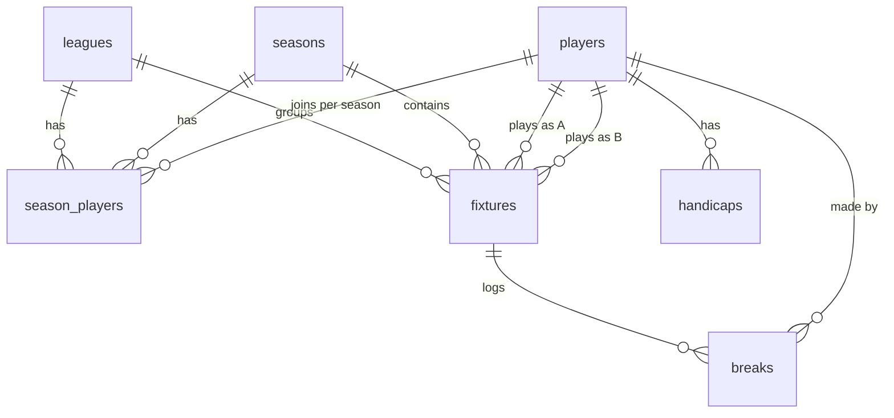

# Supabase Backend - Setup & Operations

The site reads its data from a Supabase Postgres database (project `Apps`,
ref `yzyipxvlsoxfphwobfkb`) via a single Edge Function called `ierne-api`.

## Architecture

```
Browser (static HTML)
   |  GET ?action=...&season=...
   v
Edge Function: ierne-api  (supabase/functions/ierne-api/index.ts)
   |  direct Postgres connection (SUPABASE_DB_URL)
   v
schema: ierne_snooker
   ├─ leagues           (League A, League B, ...)
   ├─ seasons           (one row per season; one is_current = true)
   ├─ players           (identity only)
   ├─ season_players    (per-season league membership)
   ├─ fixtures          (season + league + round + stage + scores)
   ├─ handicaps         (full history per player)
   └─ breaks            (big breaks per fixture per player)

   views:
   ├─ fixture_results_v   (one row per (fixture, player) for completed league play)
   ├─ league_standings_v  (P/W/L/D/+-/Pts per (season, league, player))
   └─ head_to_head_v      (record between every ordered pair, used for tiebreaks)
```

The schema is **not** added to the project's "Exposed schemas" list, so it
can't be queried directly via PostgREST. The Edge Function uses a direct
Postgres connection via `SUPABASE_DB_URL`, keeping all data inside the
`ierne_snooker` namespace and away from anonymous clients.

## Data model



### Standings calculation

`league_standings_v` is computed live from `fixtures` whenever it's read.
Rules baked into the view:

- Only `stage = 'league'` fixtures with both `score_a` and `score_b` set count.
- **Win** (frames_for > frames_against) = 2 points.
- **Draw** (frames_for == frames_against, e.g. 0-0 double-walkover) = 0 points.
- **Loss** (frames_for < frames_against) = 0 points.
- `frame_diff = sum(frames_for) - sum(frames_against)`.

Walkovers are recorded as 2-0; double-walkovers as 0-0 (zero points to both),
matching how the league has historically scored them.

### Standings ordering

The Edge Function applies the tiebreaker chain:

1. `points` desc
2. `frame_diff` desc
3. **head-to-head**, applied as a mini-league among players tied on points
   and frame diff: re-rank within the tied group by sum of H2H points
   against the other tied players, then by H2H frame diff.
4. Otherwise alphabetical (stable).

Players in `season_players` who haven't played a league fixture yet show up
with all-zero rows.

## File map

| Where                                            | What it does                                                     |
| ------------------------------------------------ | ---------------------------------------------------------------- |
| `supabase/migrations/*.sql`                      | DDL applied via `supabase db push` or the apply_migration MCP.   |
| `supabase/functions/ierne-api/index.ts`          | Edge Function source.                                            |
| `supabase/config.toml`                           | Pins the function to the project and disables JWT.               |
| `assets/js/config/app-config.js`                 | The function URL the frontend uses.                              |
| `assets/js/utils/api-client.js`                  | Browser-side wrapper around `fetch` for the function.            |
| `scripts/migrate-sheets-to-supabase.mjs`         | One-shot data migration from the legacy Google Sheets.           |
| `scripts/verify-migration.mjs`                   | Smoke test for each Edge Function action.                        |
| `docs/plans/`                                    | Architectural plans (versioned alongside the code).              |

## API contract

### GET actions

Read-only GETs require no custom headers. Default season is the row in
`seasons` with `is_current = true`. Override with `?season=<id>`.

| Action          | Query params                          | Returns                                                                                                               |
| --------------- | ------------------------------------- | --------------------------------------------------------------------------------------------------------------------- |
| `getFixtures`   | `season`                              | `{ success, season, fixtures: [{ fixtureId, playerAId, playerBId, "Game Week", "League", "Stage", "Player A", "Player B", "Match Date", "Result", scoreA, scoreB, sortOrder }] }` |
| `getStandings`  | `season`                              | `{ success, season, leagues: [{ leagueId, name, rows: [{ "Player Name", P, W, L, D, "+/-", Pts }] }], leagueA: [...], leagueB: [...] }` |
| `getHandicaps`  | -                                     | `{ success, handicaps: [...], latest: [...] }` — rows include `handicapId`, `playerId`, plus display fields `"Player Name"`, `"Handicap"`, `"Handicap Date"` |
| `getPlayers`    | `season`, `league`                    | `{ success, season?, players: [{ playerId, playerName, league?, active }] }` (no params -> every player; with params -> just that season's roster) |
| `getTopBreaks`  | `season`, `league`, `limit` (def 20)  | `{ success, season, breaks: [{ breakId, fixtureId, playerId, "Player Name", "Break", "League", "Stage", "Round", "Match Date", "Opponent" }] }` |
| `getSeasons`    | -                                     | `{ success, seasons: [{ seasonId, name, startsOn, endsOn, isCurrent }] }` |
| `getLeagues`    | -                                     | `{ success, leagues: [{ leagueId, name, displayOrder }] }` |
| `getBreaksForFixture` | `fixtureId` (uuid)              | `{ success, fixtureId, breaks: [{ breakId, playerId, value }] }` |

`leagueA` / `leagueB` on `getStandings` are a backwards-compat alias for the
existing pages while we migrate frontend code over to the structured
`leagues` array.

### POST actions (admin writes)

Mutations use `POST` with `Content-Type: application/x-www-form-urlencoded`
and a single field `data` whose value is JSON:

`{ "action": "<name>", "data": { ... }, "adminToken": "<optional>" }`

CORS stays “simple” (no preflight), matching the public site rules.

1. Call **`adminLogin`** with `{ "pin": "<same value as secret>" }` (no
   `adminToken`). On success the response includes `token` and `expiresAt`.
2. Send `adminToken` on subsequent POSTs (stored in `sessionStorage` after you use **Unlock Admin Mode** in the site menu).

Set **`IERNE_ADMIN_SECRET`** on the Edge Function (Dashboard → Edge Functions
→ `ierne-api` → Secrets). Use a long random string or a club PIN; rotating it
invalidates existing tokens. If the secret is unset, `adminLogin` returns an
error and mutations return `401 Unauthorized`.

| Action                 | `data` fields (summary) |
| ---------------------- | ----------------------- |
| `adminLogin`           | `pin` or `secret` |
| `upsertPlayer`         | `playerId`, `playerName`, `active` (optional, default true) |
| `upsertSeasonPlayer`   | `seasonId`, `playerId`, `leagueId`; or `remove: true` to drop membership |
| `upsertHandicap`       | `playerId`, `handicap`, `effectiveDate`; optional `handicapId` to update |
| `upsertSeason`         | `seasonId`, `name`, optional `startsOn`, `endsOn`, `isCurrent` |
| `upsertLeague`         | `leagueId`, `name`, `displayOrder` |
| `upsertFixture`        | optional `fixtureId`; `seasonId`, `stage` (`league` \| `knockout`), `roundLabel`, `playerAId`, `playerBId`; `leagueId` required when `stage` is `league`; optional `matchDate`, `sortOrder`, `scoreA`, `scoreB` |
| `updateFixtureResult`  | `fixtureId`, `scoreA`, `scoreB` (null/empty allowed per league rules); optional `matchDate` (`YYYY-MM-DD`) — omit to leave `match_date` unchanged |
| `upsertBreak`          | optional `breakId`; `fixtureId`, `playerId`, `value` (1–155) |
| `deleteBreak`          | `breakId` |

Errors return `{ success: false, error: "..." }` with HTTP 4xx/5xx.

## Setup from scratch

If you ever need to recreate this from a fresh Supabase project:

1. **Apply migrations** (idempotent):
   - `supabase db push` (CLI, after `supabase link --project-ref <ref>`)
   - or use the apply_migration MCP tool with the SQL in `supabase/migrations/`.

2. **Deploy the function** (required after any change to `index.ts`, including new GET actions such as `getBreaksForFixture`; otherwise the Enter result dialog cannot load breaks):
   - `supabase functions deploy ierne-api --no-verify-jwt`
   - or use the deploy_edge_function MCP tool. `SUPABASE_DB_URL` is provided
     automatically by the platform. For write APIs from the site (**Unlock Admin Mode**), add secret **`IERNE_ADMIN_SECRET`** (see API contract above).

3. **Update `assets/js/config/app-config.js`** with the new function URL.

4. **Migrate data** from the legacy Google Sheets:
   ```
   npm install
   cp .env.example .env       # then edit values
   npm run migrate:dry-run    # check counts and warnings
   npm run migrate            # live load
   ```

5. **Verify** the function returns the expected data:
   ```
   IERNE_API_URL=https://<ref>.functions.supabase.co/ierne-api npm run verify
   ```

6. **Smoke test the site** by opening each page and confirming data renders:
   - `index.html` (knockout rounds; populated only if knockout fixtures
     exist in the current season)
   - `leagues.html` and `under-development.html` (standings)
   - `fixtures.html` (upcoming, where Result is empty)
   - `results.html` (where Result is set)
   - `handicaps.html` (latest per player)
   - `top-breaks.html` (highest breaks in the current season)

## Editing data

Three options:

- **Unlock Admin Mode** (menu, bottom item): enter the same value as `IERNE_ADMIN_SECRET`, then use admin-only UI such as entering **fixtures** results on [`fixtures.html`](../fixtures.html).
- **Via the Supabase dashboard** Table Editor on the `ierne_snooker` schema.
  Useful for entering match results, breaks, and adjusting handicaps.
- **Re-run the migration script** after the source Google Sheets are
  updated. Inserts are upserts keyed on stable identifiers (player slug,
  `(season_id, stage, round_label, player_a_id, player_b_id)`,
  `(player_id, effective_date)`, `(season_id, player_id)`), so re-runs are
  safe.

### Adding a new season

1. Insert a new `seasons` row, set `is_current = true` (the partial unique
   index will reject more than one current season).
2. Set the previous season's `is_current` to `false` first.
3. Insert `season_players` rows for the players in each league for the
   season.
4. New fixtures get `season_id = '<new>'`. Standings views automatically
   only consider that season's fixtures when filtered.

### Adding a new league group

Insert a row in `leagues` with the desired `league_id` and `display_order`.
The `getStandings` action returns leagues in `display_order`. The
backwards-compat `leagueA` / `leagueB` aliases only emit for those two IDs;
new leagues live exclusively under the `leagues` array.

## Known not-yet-built

- **Write endpoints**. The function only exposes reads; admins enter
  results, breaks and handicaps via the Supabase dashboard.
- **Seasonal handicaps**. `handicaps` is global (player + effective date),
  not scoped per season. Add a `season_id` column if season-specific
  handicaps become a requirement.
- **Archive table for closed seasons**. The views handle historical reads
  fine as long as fixtures stay in place; an explicit archive (frozen
  end-of-season standings) would only be needed if you're worried about
  ever deleting old fixtures.
