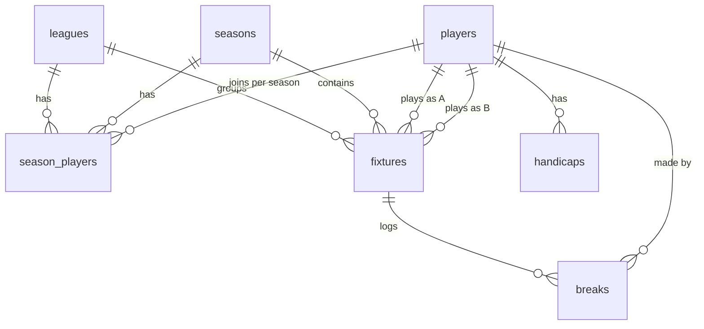

# Leagues + Seasons Rework

> Status: completed (migration `20260505213000_redesign_leagues_seasons.sql`,
> `ierne-api` version 4 deployed). This document is kept as the design
> record; for the live operational view see [`SUPABASE_SETUP.md`](../SUPABASE_SETUP.md).

## Why

The original schema stored standings in a hand-maintained `league_standings`
table whose rows came from a Google Sheet that was actually computed by
formulas — so when we imported the sheet's stored values they were all
zero. We also had:

- `players.league` as a single text column (no FK, no per-season concept).
- No way to scope fixtures by season or distinguish league play from
  knockout matches.
- No place to record big breaks for the Top Breaks page.

This rework switches to:

- Multiple league groups, modelled as a real table with FKs.
- Per-season membership so a player can change league between seasons.
- Knockout fixtures live in the same table but are explicitly tagged.
- Standings are derived from `fixtures` on every read (no drift, no
  second action when a result is corrected).
- Head-to-head as the third tiebreaker, applied in the Edge Function
  using a SQL view.
- Big breaks tracked per fixture per player in their own table, with a
  Top Breaks leaderboard for the current season.

## New schema

Single migration: [`supabase/migrations/20260505213000_redesign_leagues_seasons.sql`](../../supabase/migrations/20260505213000_redesign_leagues_seasons.sql).

Top-level changes:

- `+ leagues`          — one row per league group (A, B, ...).
- `+ seasons`          — one row per season; partial unique index enforces
  exactly one `is_current = true`.
- `+ season_players`   — per-season league membership (replaces
  `players.league`).
- `+ breaks`           — one row per recorded big break per fixture per
  player. `value` constrained to `1..155`. Multiple rows per
  `(fixture, player)` are expected and correct.
- `~ players`          — drops `league`, adds `active boolean`.
- `~ fixtures`         — adds `season_id`, `stage` (`league` | `knockout`),
  `round_label`; renames `league` → `league_id`; drops `game_week`,
  `result_text`. New unique pairing:
  `(season_id, stage, round_label, player_a_id, player_b_id)`.
- `- league_standings` — dropped, replaced by `league_standings_v`.

### Backfill (executed in the same migration, before the destructive bits)

- Seed `leagues`: `('A','League A',1)`, `('B','League B',2)`.
- Seed `seasons`: `('2025-26','2025/26 Season','2025-09-01','2026-05-31',true)`.
- Backfill `season_players` from existing `players.league`.
- Update `fixtures` with `season_id = '2025-26'`,
  `round_label = game_week`,
  `stage = case when game_week in ('CS','CF','PQ','PS','PF') then 'knockout' else 'league' end`.

## Views

```sql
-- Per-fixture per-player rows (one match contributes 2 rows).
create view ierne_snooker.fixture_results_v as ...;

-- Standings: P / W / L / D / +- / Pts per (season, league, player).
-- 2 points for a win; 0 for a draw or loss (matches league rules: a 0-0
-- double-walkover gives both players zero).
create view ierne_snooker.league_standings_v as ...;

-- Head-to-head per ordered (player, opponent) pair, used by the
-- Edge Function tiebreaker.
create view ierne_snooker.head_to_head_v as ...;
```

`league_standings_v` only emits rows for players who have played at least
one league fixture. The Edge Function outer-joins with `season_players`
so unplayed members appear with all-zero rows.

## Edge Function changes

[`supabase/functions/ierne-api/index.ts`](../../supabase/functions/ierne-api/index.ts):

- All read actions accept an optional `?season=<id>`. Default is the row
  in `seasons` with `is_current = true`.
- `getStandings` builds rows from `season_players LEFT JOIN
  league_standings_v`, sorts by `(points desc, frame_diff desc)`, then
  for each tie group of size ≥ 2 applies a head-to-head mini-league
  (sum of H2H points among the tied players, then H2H frame diff,
  then alphabetical).
- `getFixtures` is scoped by season and exposes `Stage` alongside the
  pre-existing `'Game Week'` field (which now carries `round_label`).
- `getTopBreaks` is new: `?season=`, `?league=`, `?limit=` (default 20).
  Returns the highest breaks for the season, joined to player + fixture
  context (round, opponent, league).

The function continues to talk directly to Postgres via
`SUPABASE_DB_URL` (rather than going through PostgREST) because the
`ierne_snooker` schema is not on the project-wide exposed-schemas list.

## Frontend impact

- Existing pages (leagues, fixtures, results, handicaps, index,
  under-development): no changes required. The Edge Function preserves
  the same JSON shapes (`'Player Name'`, `P`, `W`, `L`, `'+/-'`, `Pts`,
  etc.).
- [`top-breaks.html`](../../top-breaks.html): placeholder list replaced
  with a container (`#topBreaksList`) and current-season label
  (`#topBreaksSeason`) that the new page module fills.
- [`assets/js/pages/top-breaks.js`](../../assets/js/pages/top-breaks.js):
  new module, registered in [`main.js`](../../assets/js/main.js) by
  detecting `#topBreaksList`. Renders an ordered list of
  `value Player Name (League X, Round N, vs Opponent)`, with a graceful
  empty state.

## Migration script

[`scripts/migrate-sheets-to-supabase.mjs`](../../scripts/migrate-sheets-to-supabase.mjs)
upserts into `seasons`, `players`, `season_players`, `fixtures`,
`handicaps`. It no longer touches `league_standings` (gone) and infers
`league_id` and `stage` for each fixture from the leagues sheet plus the
`KNOCKOUT_LABELS` set.

## ER diagram



Plus the views `fixture_results_v`, `league_standings_v`, `head_to_head_v`
rolling up from `fixtures`.

## Explicitly NOT in scope

- Admin write endpoints for entering results / breaks (entries continue
  to land via SQL or the Supabase dashboard for now).
- Seasonal handicaps (handicaps remain global with `effective_date`).
- Archive table for closed seasons (the views already cover historical
  reads as long as the rows stay in `fixtures`).
- A minimum-break threshold (e.g. only show breaks ≥ 30). Schema
  records every break; threshold is a query/display concern.
